## Fork Contact Form

1. Log in to <a href="https://www.github.com/" target="_blank">**GitHub**</a>.
2. Navigate to <a href="https://github.com/christopherehlen/contact-form" target="_blank">**github.com/christopherehlen/contact-form**</a> repository.
2. In the upper right corner, click the **Fork** button.

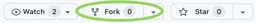

2. Click the **Create fork** button.

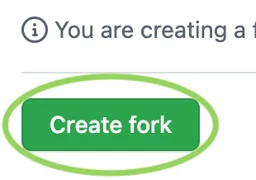

## Create Worker Subdomain

1. Log in to <a href="https://www.cloudflare.com/" target="_blank">**Cloudflare**</a>.
2. In the left pane, click the **Workers** option.

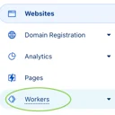

3. If prompted, set the account's worker subdomain.

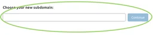

4. Your **Subdomain** and **Account ID** are in the right pane. Save both the **Subdomain** and **Account ID** somewhere; you will need them to set the **Contact Form's** environment variables later.

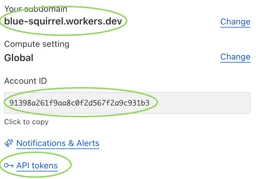

## Create API Token

1. From the previous step, click the **API tokens** option.

2. Click the **Create Token** button.

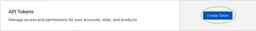

3. In the **Edit Cloudflare Workers** option, click the **Use Template** button.

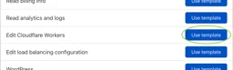

3. Set **Include All...** for both **Account and Zone Resources**.

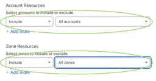

3. Click the **Continue to Summary** button.

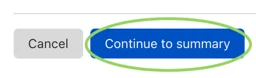

3. Click the **Create Token** button.

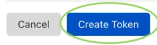

4. Click the **Copy** button. Save the token somewhere; you will need it to set the **Contact Form's** environment variables later. **IMPORTANT!** this is the only time the API token will be visible to you; if you lose the token, you must create a new one.

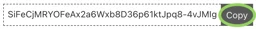

## Connect to GitHub

1. In the left pane, click the **Pages** option.

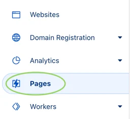

2. Click the **Create a Project** button.

3. Click the **Connect to Git** button.

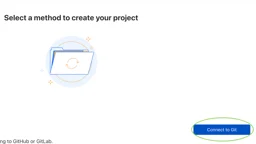

4. Click the **Connect GitHub** button.

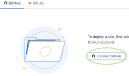

5. If prompted, sign in to **GitHub**.

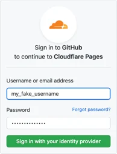

6. If prompted, authorize **Cloudflare** access to **GitHub**.

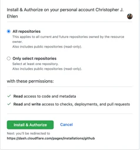

7. Select **contact-form** option and click **Begin setup** button.

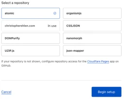

## Setup Build

1. Set the **Project name** field to **contact-form**. Save the **Domain** listed below **Project name** field; you will need it to set the **Contact Form's** environment variables later.

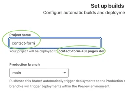

2. Set the **Build command** field to **npm run deploy**.
3. Set the **Build output directory** field to **public_html**.

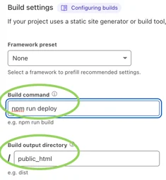

4. Click the **Environment Variables** dropdown.

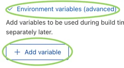

5. Add the following environment variables.
    - Set **NODE_VERSION** to 16.13.1.
    - Set **CLOUDFLARE_ACCOUNT_ID** to the **Account ID** saved in **Create Worker Subdomain** section **Step 4**.
    - Set **CLOUDFLARE_API_TOKEN** to the **API Token** saved in **Create API Token** section **Step 4**.
    - Set **$SYS_ALLOW_ORIGIN** to the **Domain Name** saved in **Setup Build** section **Step 1**.
    - Set **SYS_BASE_URL** to the **Domain Name** saved in **Setup Build** section **Step 1**.
    - Set **SYS_BASE_API_URL** to the **Worker Subdomain** with a **contact-form** prefix saved in **Create Worker Subdomain** section **Step** 4, i.e., ***contact-form.blue-squirrel.workers.com***.
    - Set **SYS_NOTION_TOKEN** to the **API Token** saved in **Generate a Notion Integration Token** section **Step 7**.
    - Set **SYS_PAGE_NAME** to the **Name** saved in **Create a Notion Page** section **Step 3**.

5. Click the **Save and Deploy** button.

