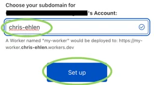
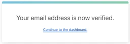
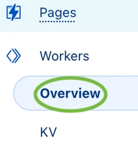
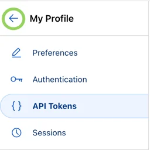
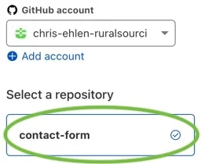
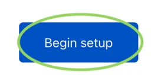

## Fork Contact Form

1. Log in to <a href="https://www.github.com/" target="_blank">**GitHub**</a>.
2. Navigate to <a href="https://github.com/christopherehlen/contact-form" target="_blank">**github.com/christopherehlen/contact-form**</a> repository.
2. In the upper right corner, click the **Fork** button.


2. Click the **Create fork** button.


## Create Worker Subdomain

**You will only have to complete this step the first time you create a worker for this account.**

1. Log in to <a href="https://www.cloudflare.com/" target="_blank">**Cloudflare**</a>.
2. In the left pane, click the **Workers** option.


3. If prompted, set the account's worker subdomain.



4. If prompted, verify email account.




5. Navigate to Workers Overview page.



6. Your **Subdomain** and **Account ID** are in the right pane. Save both the **Subdomain** and **Account ID** somewhere; you will need them to set the **Contact Form's** environment variables later.


## Create API Token

1. From the previous step, click the **API tokens** option.

2. Click the **Create Token** button.


3. In the **Edit Cloudflare Workers** option, click the **Use Template** button.


4. Set **Include All...** for both **Account and Zone Resources**.


5. Click the **Continue to Summary** button.


6. Click the **Create Token** button.


7. Click the **Copy** button. Save the token somewhere; you will need it to set the **Contact Form's** environment variables later. **IMPORTANT!** this is the only time the API token will be visible to you; if you lose the token, you must create a new one.


8. Click back to My Profile.



## Connect to GitHub

1. In the left pane, click the **Pages** option.


2. Click the **Create a Project** button.


3. Click the **Connect to Git** button.


4. Click the **Connect GitHub** button.


5. If prompted, sign in to **GitHub**.


6. If prompted, authorize **Cloudflare** access to **GitHub**.


7. Select **contact-form** optionn.



8. Click the **Begin setup** button.



## Setup Build

1. Set the **Project name** field to **contact-form**. Save the **Domain** listed below **Project name** field; you will need it to set the **Contact Form's** environment variables later.


2. Set the **Build command** field to **npm run deploy**.
3. Set the **Build output directory** field to **public_html**.


4. Click the **Environment Variables** dropdown.


5. Add the following environment variables.
    - Set **NODE_VERSION** to 16.13.1.
    - Set **CLOUDFLARE_ACCOUNT_ID** to the **Account ID** saved in **Create Worker Subdomain** section **Step 6**.
    - Set **CLOUDFLARE_API_TOKEN** to the **API Token** saved in **Create API Token** section **Step 7**.
    - Set **SYS_ALLOW_ORIGIN** to the **Domain Name** saved in **Setup Build** section **Step 1** i.e., ```https://contact-form-43i.pages.dev```
    - Set **SYS_BASE_URL** to the **Domain Name** saved in **Setup Build** section **Step 1** i.e., ```https://contact-form-43i.pages.dev```
    - Set **SYS_BASE_API_URL** to the **Worker Subdomain** with a **contact-form** prefix saved in **Create Worker Subdomain** section **Step** 6, i.e., ```https://contact-form.blue-squirrel.workers.dev```
    - Set **SYS_NOTION_TOKEN** to the **API Token** saved in **Generate a Notion Integration Token** section **Step 7**.
    - Set **SYS_PAGE_NAME** to the **Name** saved in **Create a Notion Page** section **Step 3**.

5. Click the **Save and Deploy** button.


### IMPORTANT READ BEFORE CONTINUING ON TO STEP 6!

The **Contact Form** database will be created the first time a **Contact Form** is rendered; this will take 15-60 seconds, and during this time, the form will be disabled. Wait to reload the page until this process has completed.

6. Once successfully deployed, navigate to the **Domain Name** saved in **Setup Build** section **Step 1** i.e., ```https://contact-form-43i.pages.dev```