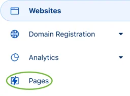
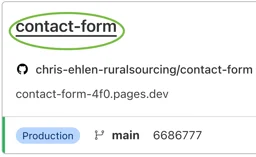
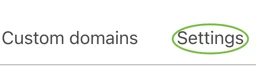
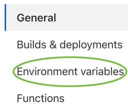
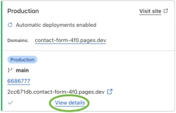
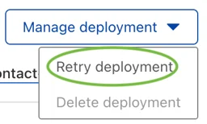
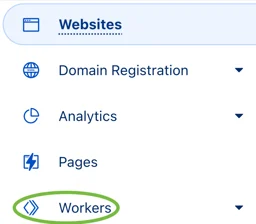
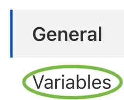

# Environment Variables

Environment variables configure most of the Contact Form's attributes and behavior. The .env, .env.local, and .env.prod files set most variables with some references to system environment variables, each prefixed with **SYS_**.

## Local Development

The **npm run http** script depends on local development environment variables.

**PORT:** local HTTP server port number.

## Build

The **npm run build**, **npm run watch** and **npm run deploy** scripts depend on build environment variables.

**ORGANISM_NAME:** name of the organism.

**ORGANISM_ALIAS:** abbreviated alternative for organism type.

**ORGANISM_TYPE:** type of organism.

**PREFIX_WORKER_ENDPOINTS:** if the flag is true, prefix worker endpoints with a unique hash code.

**PREFIX_WORKER_VARS:** if the flag is true, prefix worker variables with a unique hash code.

**PREFIX_CSS_SELECTORS:** if the flag is true, prefix CSS selectors with a unique hash code.

## Contact Form

The **Contact Form** widget executing in the browser depends on contact form variables.

**BASE_URL:** base URL of the page rendering the Contact Form widget.

**BASE_API_URL:** base API URL for Contact Form RESTful APIs.

**CONTACT_FORM_SHOW_ALERT:** if the flag is true, success and fail, alerts are displayed.

## Cloudflare Worker

Worker functions executing on the Cloudflare network depend on Cloudflare worker variables.

**ALLOW_ORIGIN:** Access-Control-Allow-Origin HTTP header, this environment variable can have multiple origins defined, each separated by a comma. , i.e., ***https://contact-form-43i.pages.dev, https://christopherehlen.com***.

## Notion

Worker functions executing on the Cloudflare network depend on Notions variables to communicate with the Notion API.

**NOTION_TOKEN:** token for Notion's RESTful API.

**NOTION_VERSION:** version of Notion's RESTful API.

**PAGE_NAME:** name of Notion page containing contact form database.

**DATABASE_NAME:** contact form database name.

## Changing Browser Variables

Set environment variables globally with organismJS.config.env

```js
    organismJS.config.env.set('*', {
        CONTACT_FORM_SHOW_ALERT: false
    });
    organismJS.initialize(organismJS.config).then(context => {...});
```

**Or** for specific organism types

```js
    organismJS.config.env.set('christopherehlen.com/organisms/contact-form', {
        CONTACT_FORM_SHOW_ALERT: false
    });
    organismJS.initialize(organismJS.config).then(context => {...});
```

## Changing Deployment Variables

1. In the left pane, click the **Pages** option.



2. Click the **contact-form** page.



3. Click the **Settings** option.



4. In the left pane, click the **Environment Variables** option.



5. Click the **Edit Variables** button.


6. Add, remove, and edit desired variables.
7. Click the **Save** button.


8. Click the **Deployments** option.


8. Click the **View Details** option of the current build.



9. In the **Manage deployment** drop-down list, click the **Retry deployment** option.



## Changing Worker Variables

1. In the left pane, click the **Workers** option.



2. Click the **contact-form** worker.


3. Click the **Settings** option.


4. In the left pane, click the **Variables** option.



5. Click the **Edit variables** button.


6. Add, remove, and edit desired variables.
7. Click the **Save and deploy** button.

