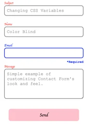

## Using Contact Form

- Add the domain of the page displaying the **Contact Form** widget to the **ALLOW_ORIGIN** environment variable; otherwise, you may get the following CORS error.
    ```
    Cross-Origin Request Blocked: The Same Origin Policy disallows
    reading the remote resource at https://some-url-here. (Reason:
    additional information here).
    ```

    For details refer to:
    - **Configuration** -> **Cloudflare Worker** -> **ALLOW_ORIGIN**.
    - **Cloudflare Deployment** -> **Setup Build** -> **Step 5**.

- Include the external **organism.js** script.
    ```html
    <script src="${BASE_URL}/organism.js"></script>
    ```
- Include the external **contact-form.js** script.
    ```html
    <script src="${BASE_URL}/contact-form.js"></script>
    ```
- Render the **Contact Form** in an existing HTML element.
    ```js
    contact_form.render(`${ELEMENT_ID}`);
    ```
- Initialize **OrganismJS** in the window onload event.
    ```js
    window.addEventListener("load", (event) => {
        organismJS.initialize(organismJS.config).then(context => { });
    });
    ```

Complete example if served from localhost.

```html
<!DOCTYPE html>
<html>
    <head>
        <title>Using Contact Form</title>
        <meta charset="UTF-8">
        <meta name="viewport" content="width=device-width, initial-scale=1.0">
        <style>
            #put-it-here {
                width: 33%;
                margin: auto;
            }
        </style>

        <!-- Replace http://localhost:8080/scripts/ with the appropriate base URL. -->
        <script src="http://localhost:8080/scripts/organism.js"></script>

        <!-- Replace http://localhost:8080/organisms/ with the appropriate base URL. -->
        <script src="http://localhost:8080/organisms/contact-form.js"></script>
    </head>
    <body>
        <div id="put-it-here"></div>
        <script>
            
            // Global variable contact_form declared in contact-form.js
            contact_form.render('put-it-here');

            // The call to organismJS.initialize(...) must occur in the window onload event.
            window.addEventListener("load", (event) => {

                // Global variable organismJS declared in organism.js
                organismJS.initialize(organismJS.config).then(context => { });
            });
        </script>
    </body>
</html>
```

## JavaScript API

**contact_form.FormState:** contact form state.
```js
class FormState {
    constructor() {
        this.subject = '';
        this.name = '';
        this.email = '';
        this.message = '';
        this.ready = false;
        this.sendInProgress = false;
        this.sendSuccessful = false;
        this.sendFailed = false;
        this.sendAttempts = 0;
        this.showAlert = true;
        this.databaseId = null;
    }
}
```

**contact_form.FormModel:** view model for **index.dot** view.
```js
class FormModel {
    constructor(state) {
        Object.assign(this, state ?? new FormState());
    }
    alert() {...}
    subjectField() {...}
    nameField() {...}
    emailField() {...}
    messageField() {... }
    sendButton() {...}
    isDisabled() {...}
}
```

**contact_form.Index:** Alias for **contact_form.FormModel**.

```js
const Index = FormModel;
```

**contact_form.Widget:** view model for contact form widget.

```js
class Widget {
    constructor() {
        this.id = 'widget';
        this.group = null;
        this.state = null;
        this.params = null;
        this.filter = null;
        this.adaptor = null;
        this.model = new Index();
        this.cssPrefix = null;
    }
}
```

**contact_form.RenderOptions:** render options.

```js
class RenderOptions {
    constructor() {
        this.tagName = 'div';
        this.attributes = {};
        this.dataset = {};
        this.classes = [];
        this.style = {};
        this.append = false;
    }
}
```

**contact_form.render:** renders the contact form.

```js
function render(elementId, widget, options) {...}
```

## Events

**onSendSuccessful:** event emits when a contact form message is sent successfully.

```js
{}
```

**onSendFailure:** event emits when a contact form message send failss.

```js
{}
```

### Listen for Contact Form Events

```js
organismJS.initialize(organismJS.config).then(context => {
    context.addEventListener('christopherehlen.com/organisms/contact-form#onSendSuccessful', (source, event, stateful) => {...}, true);
    context.addEventListener('christopherehlen.com/organisms/contact-form#onSendFailure', (source, event, stateful) => {...}, true);
});
```

## CSS Variables

```css
.contact-form {
  --alert-font-family: Arial, Helvetica, sans-serif;
  --alert-success-color: green;
  --alert-fail-color: red;
  --label-font-family: Arial, Helvetica, sans-serif;
  --label-font-Color: black;
  --input-font-family: Arial, Helvetica, sans-serif;
  --invalid-font-family: Arial, Helvetica, sans-serif;
  --input-color: black;
  --send-bg-color: #3498db;
  --send-font-family: Arial, Helvetica, sans-serif;
  --send-font-color: white;
  --invalid-color: red;
}
```

Changing CSS Variables will change how **Contact Form** is displayed.

```html
<head>
    <title>Using Contact Form</title>
    <meta charset="UTF-8">
    <meta name="viewport" content="width=device-width, initial-scale=1.0">
    <style>
        #put-it-here {
            width: 33%;
            margin: auto;
        }
        .contact-form {
            --alert-font-family: cursive;
            --alert-success-color: orange;
            --alert-fail-color: teal;
            --label-font-family: cursive;
            --label-font-Color: red;
            --input-font-family: 'Courier New', monospace;
            --invalid-font-family: 'Courier New', monospace;
            --input-color: grey;
            --send-bg-color: pink;
            --send-font-family: cursive;
            --send-font-color: black;
            --invalid-color: blue;
        }
    </style>
    <script src="http://localhost:8080/scripts/organism.js"></script>
    <script src="http://localhost:8080/organisms/contact-form.js"></script>
</head>
```

The CSS above would have the following effect on **Contact Form**.



