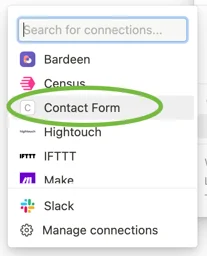

## Prerequisites

- <a href="https://github.com/" target="_blank">**GitHub**</a> account to fork/clone **github.com/christopherehlen/contact-form**.
- <a href="https://www.notion.so/" target="_blank">**Notion**</a> account to store contact messages.
- <a href="https://www.cloudflare.com/" target="_blank">**Cloudflare**</a> account to host the contact-form widget and RESTful webservices.
- Install <a href="https://github.com/git-guides/install-git" target="_blank">**git**</a> to run on your local machine. ***[Optional]***
- Install <a href="https://nodejs.org/" target="_blank">**Node.js**</a> to run on your local machine. ***[Optional]***

## Generate a Notion Integration Token

1. Log in to <a href="https://www.notion.so/" target="_blank">**Notion**</a>.
2. In the left pane, click the **Settings & Members** option.


3. In the modal, click the **My connections** option.


4. In the modal, click the **Develop or manage integrations** option.


5. A new browser tab will open, click the **New Integration** option.


6. Type the name of the new integration and click the **Submit** button.


7. Click the **show** option then copy the token. Save the token somewhere; you will need it to configure the **Contact Form** later.


## Create a Notion Page

1. Return to the original <a href="https://www.notion.so/" target="_blank">**Notion**</a> window.
2. In the left pane, click the **+ Add a page** option.


3. In the main content pane, type the name of your page. Save the page's name somewhere; you will need it to configure the **Contact Form** later.


## Add connection to Notion Page

1. In the upper right corner, click the **...** icon.


2. At the bottom of the menu, Click the **+ Add connections** option.


3. In the submenu, click the name of the connection created in the **Generate a Notion Integration Token** step. Sometimes there is a delay between completing the connection and when it is available. If the connection name is not there, wait a minute or two and try again.



4. In the modal, click the **confirm** button.


## Setup Local Environment ***[Optional]***

1. Clone the **Contact Form** repository.

```bash
git clone https://github.com/christopherehlen/contact-form.git
```

2. Change to contact-form directory.

```bash
cd contact-form
```

3. Install packages.

```bash
npm install
```

4. Edit Notion evironment variables.
    1. Rename **.env.local.sample** to **.env.local**.
    2. Open the **.env.local** file in the project root directory.
    3. Uncomment the Notion variables.
    4. Set **_NOTION_TOKEN** to the API token generated in the **Generate a Notion Integration Token** section **Step 7**.
    5. Set **_NOTION_VERSION** to "2022-06-28".
    6. Set **_PAGE_NAME** to the page name created in the **Create a Notion Page** section **Step 3**.
    7. Set **_DATABASE_NAME** to "Contact Form".

```bash
###
# Notion variables
#
##
_NOTION_TOKEN = secret_GfjiEQSIFlfj1idoiajd
_NOTION_VERSION = 2022-06-28
_PAGE_NAME = Online Forms
_DATABASE_NAME = Contact Form
```

5. Build contact-form.

```bash
npm run build
```

**Or** to build automatically when files change.

```bash
npm run watch
```

6. In a separate terminal, start the local Cloudflare server.

```bash
npm run worker
```

7. In a separate terminal, start the local HTTP server.

```bash
npm run http
```

### IMPORTANT READ BEFORE CONTINUING ON TO STEP 8!

The **Contact Form** database will be created the first time a **Contact Form** is rendered; this will take 15-60 seconds, and during this time, the form will be disabled. Wait to reload the page until this process has completed.

8. In browser goto ```http://localhost:8080/organisms/contact-form.html?width=30pct```

